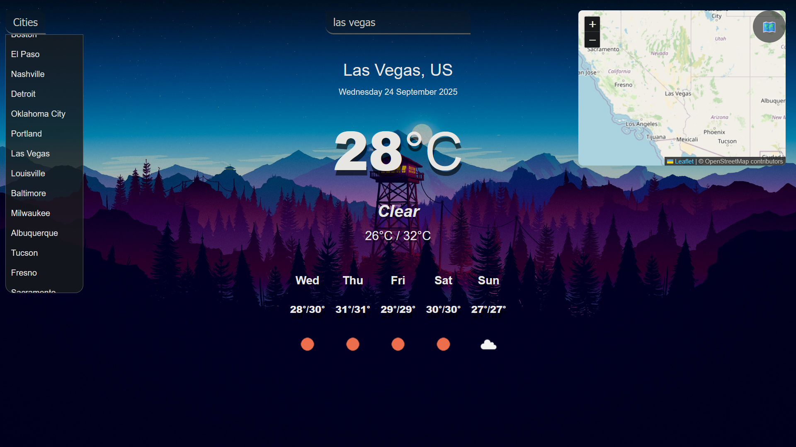

# Weather App

A responsive weather application that displays current weather and 5-day forecast for cities worldwide.

## Live Demo

Visit the live application: [Weather App](https://rudraambike.github.io/simple-weather-app/)

## Features

- Search for weather by city name
- City dropdown for quick selection
- Display current temperature, weather conditions, and min/max temperatures
- 5-day weather forecast
- Interactive map integration for location-based weather search
- Responsive design for all devices

## Technologies Used

- HTML
- CSS
- JavaScript (ES6+)
- OpenWeatherMap API for weather data
- Leaflet.js for interactive maps

## Screenshot



## How to Use

1. Enter a city name in the search box and press Enter
2. Or select a city from the dropdown list
3. Click on the map button to open an interactive map
4. Click anywhere on the map to get weather for that location

## API Key

The app uses the OpenWeatherMap API. To use your own API key:
1. Register at [OpenWeatherMap](https://openweathermap.org/) to get an API key
2. Replace the API key in `main.js`:

```javascript
const api = {
  key: "YOUR_API_KEY_HERE",
  base: "https://api.openweathermap.org/data/2.5/"
};
```
